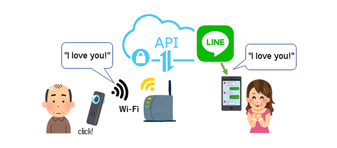
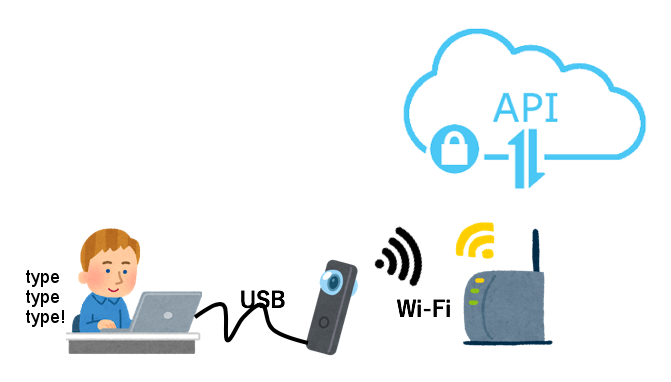
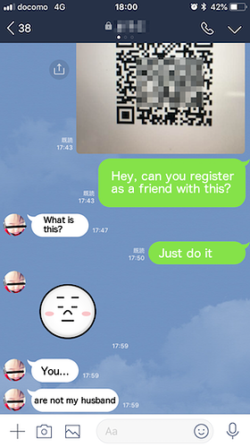
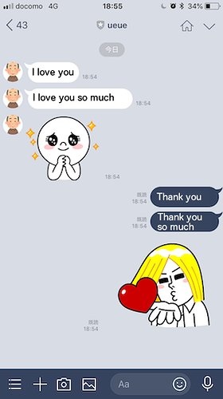

# RICOH THETA Messaging Plug-in for LINE Messaging API

by [ue ue](https://qiita.com/ueue)

    curl -v -X POST https://api.line.me/v2/bot/message/push \
    -H 'Content-Type:application/json' \
    -H 'Authorization: Bearer <Access Token>' \
    -d '{
        "to": "<User ID>",
        "messages":[
            {
                "type":"text",
                "text":"I love you"
            },
            {
                "type":"text",
                "text":"I love you so much"
            },
            {
              "type": "sticker",
              "packageId": "1",
              "stickerId": "409"
            }
        ]
    }'

